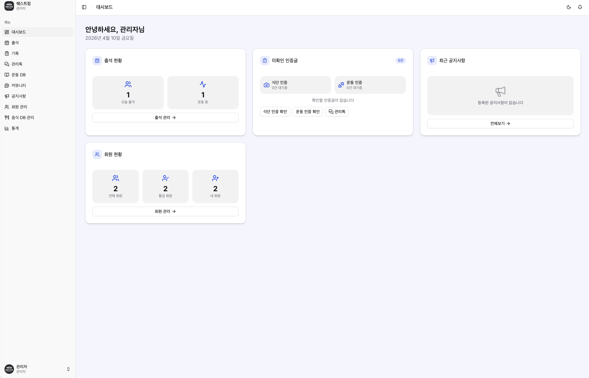
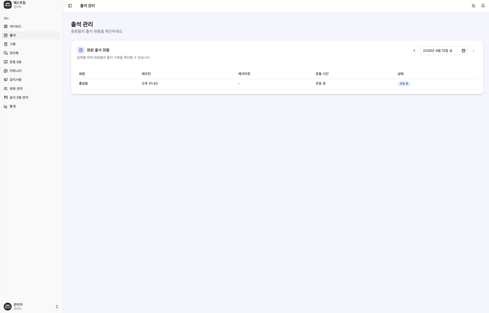
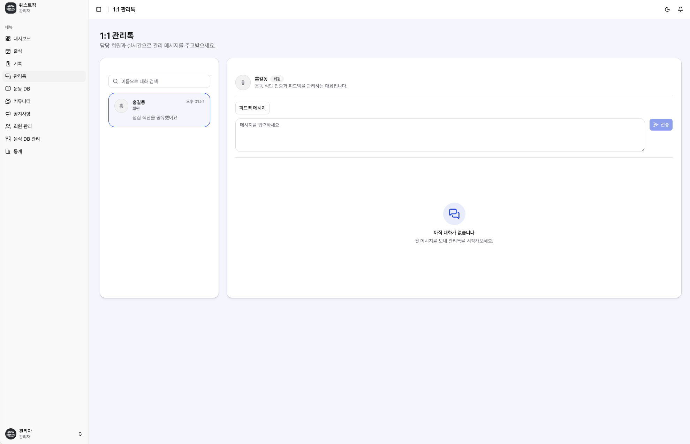

# 웨스트짐 플랫폼

회원, 트레이너, 관리자가 하나의 웹 서비스 안에서 출석, 식단, 운동, 관리톡, 공지, 통계를 함께 관리할 수 있는 헬스장 운영 플랫폼입니다.

Next.js App Router 기반으로 구축되어 있으며, 역할별 화면 분기와 실시간 관리 흐름에 맞춰 설계되어 있습니다.

## 주요 기능

- 역할 기반 대시보드: 회원, 트레이너, 관리자 권한에 따라 다른 메뉴와 화면을 제공합니다.
- 출석 관리: 체크인/체크아웃, 출석 현황 확인, 날짜별 출석 기록 조회를 지원합니다.
- 식단 인증 관리: 회원 식단 기록 조회, 상세 확인, 피드백 전송, 확인 여부 표시를 제공합니다.
- 운동 인증 관리: 회원 운동 기록 조회, 상세 확인, 피드백 전송, 확인 여부 표시를 제공합니다.
- 관리톡: 회원과 트레이너/관리자가 실시간으로 커뮤니케이션할 수 있습니다.
- 공지 및 커뮤니티: 공지사항, 커뮤니티 기능으로 센터 소통을 지원합니다.
- 통계 및 운영 관리: 회원 현황, 출석, 운동, 식단, 인바디 기반 운영 데이터를 확인할 수 있습니다.
- PWA 지원: 홈 화면 설치, 오프라인 페이지, 모바일 앱처럼 사용할 수 있는 환경을 제공합니다.

## 서비스 화면

### 대시보드

운영에 필요한 핵심 지표를 한눈에 확인할 수 있는 관리자 대시보드입니다.



### 출석 관리

회원 체크인/체크아웃 상태와 당일 운동 현황을 날짜 기준으로 확인할 수 있습니다.



### 관리톡

회원과 1:1로 소통하며 식단/운동 피드백을 빠르게 전달할 수 있습니다.



## 기술 스택

- Framework: Next.js 16
- Language: TypeScript
- UI: Tailwind CSS v4, shadcn/ui
- State: Zustand, TanStack Query
- API: Hono
- Database/Auth: Supabase
- Storage: Cloudflare R2
- Test: Vitest, React Testing Library, MSW, Playwright
- PWA: Serwist

## 프로젝트 구조

이 프로젝트는 FSD(Feature-Sliced Design) 구조를 따릅니다.

```text
src/
├── app/          # Next.js App Router, 라우팅 및 엔트리
├── views/        # 페이지 단위 컴포지션
├── widgets/      # 복합 UI 블록
├── features/     # 비즈니스 기능
├── entities/     # 도메인 엔티티
└── shared/       # 공통 유틸, UI, 설정
```

## 시작하기

### 1. 패키지 설치

```bash
pnpm install
```

### 2. 개발 서버 실행

```bash
pnpm dev
```

### 3. 주요 명령어

```bash
pnpm build       # 프로덕션 빌드
pnpm start       # 프로덕션 실행
pnpm lint        # ESLint
pnpm typecheck   # 타입 검사
pnpm test        # Vitest 실행
pnpm test:e2e    # Playwright E2E 테스트
```

## 환경 변수

실행 전 아래 환경 변수가 필요합니다.

```bash
NEXT_PUBLIC_SUPABASE_URL=
NEXT_PUBLIC_SUPABASE_PUBLISHABLE_DEFAULT_KEY=
R2_ACCOUNT_ID=
R2_ACCESS_KEY_ID=
R2_SECRET_ACCESS_KEY=
R2_BUCKET_NAME=
NEXT_PUBLIC_R2_PUBLIC_URL=
```

프로젝트 환경에 맞는 값은 `.env.local`에 설정해서 사용합니다.

## 운영 포인트

- 관리자 계정은 회원/트레이너 관리 및 운영 기능 전반에 접근할 수 있습니다.
- 출석은 미체크아웃 상태가 남지 않도록 자동 종료 로직이 반영되어 있습니다.
- 식단/운동 인증은 상세 열람 시 확인 처리되며, 관리 화면에서 확인 상태를 바로 볼 수 있습니다.
- 모바일 홈 화면 설치 시 PWA 형태로 동작합니다.

## 테스트

단위 테스트와 위젯 테스트는 Vitest 기반으로 구성되어 있습니다.

```bash
pnpm test
```

특정 위젯만 빠르게 검증하고 싶다면 예를 들어 아래처럼 실행할 수 있습니다.

```bash
pnpm exec vitest run src/widgets/diet/meal-member-table.test.tsx
pnpm exec vitest run src/widgets/workout/workout-member-table.test.tsx
```

## 라이선스

사내/프로젝트 용도로 개발된 웨스트짐 플랫폼입니다.
